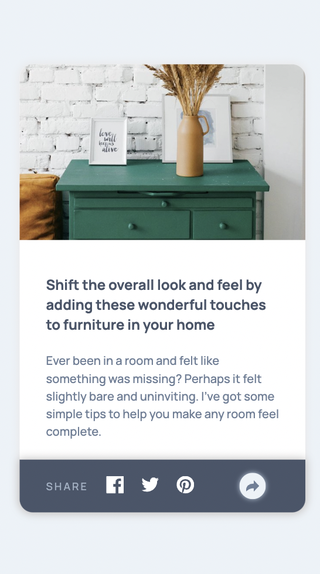
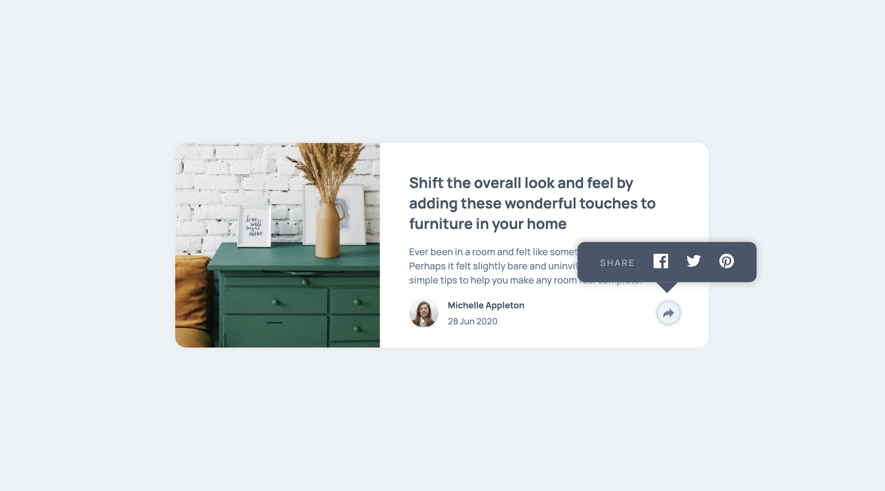

# Frontend Mentor - Article Preview Component

---

## Table of Content

* [Useful Links](#useful-links)
* [Mobile version](#mobile)
* [Desktop version](#desktop)

---

### Useful Links 

* [FM - Article Preview Component](https://www.frontendmentor.io/challenges/article-preview-component-dYBN_pYFT)

* [Vercel: My Solution](https://js-fm-03-article-preview-component.vercel.app/)

--- 
### Mobile version 

--- 
### Desktop version 

